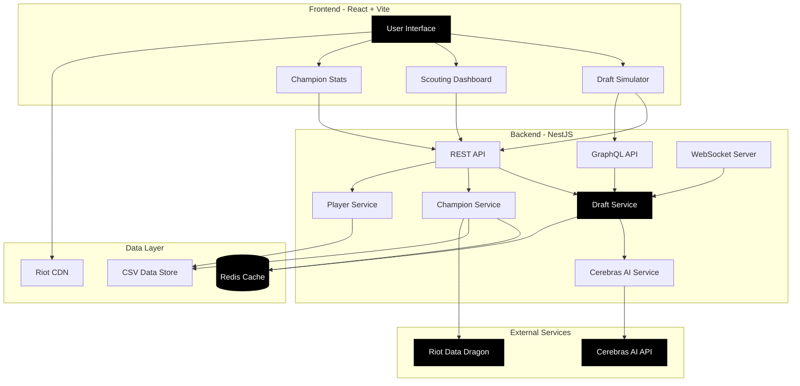
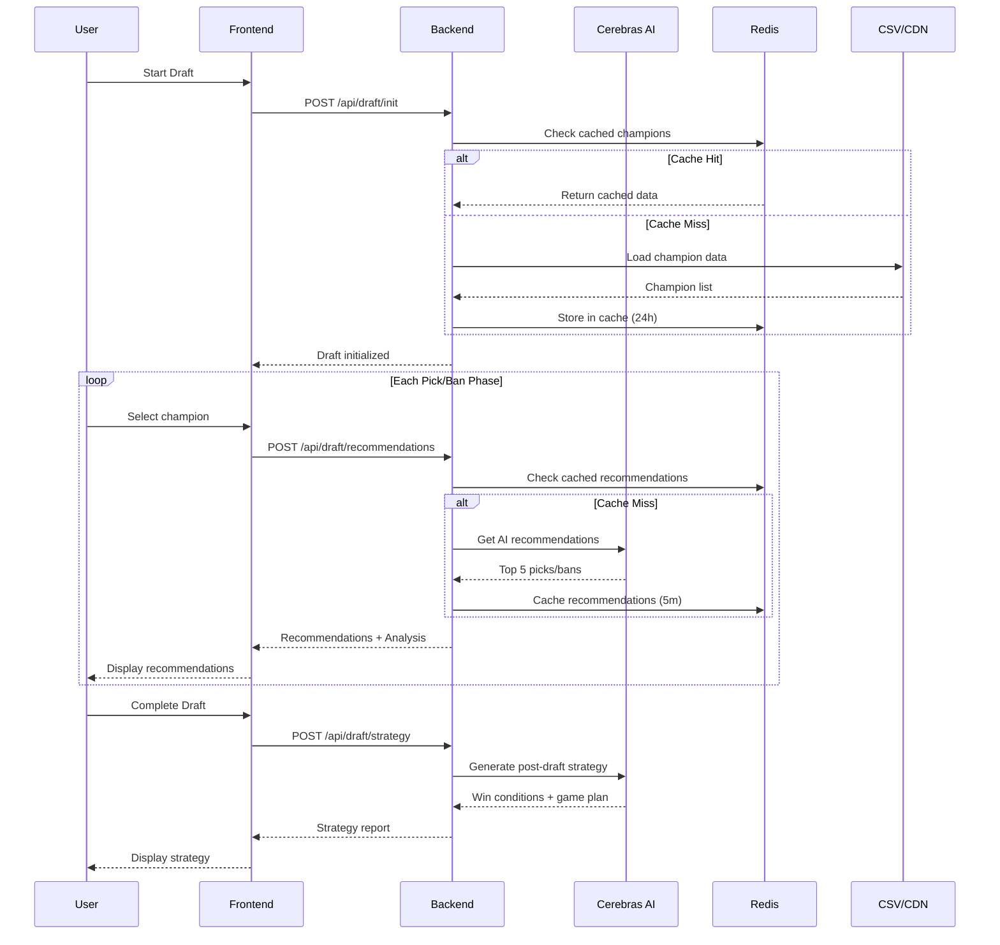
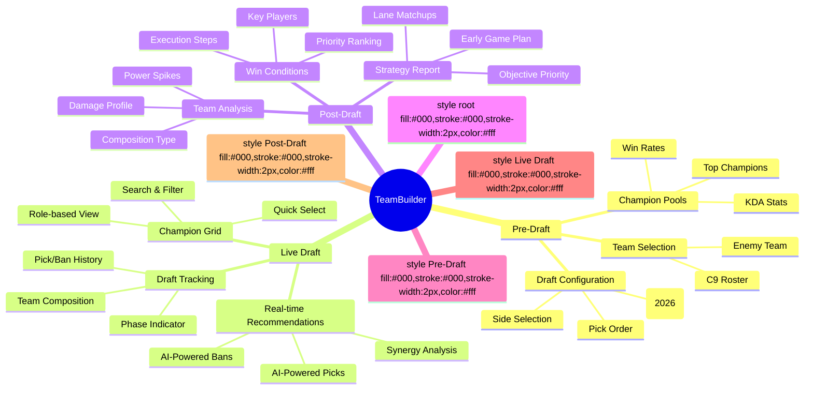
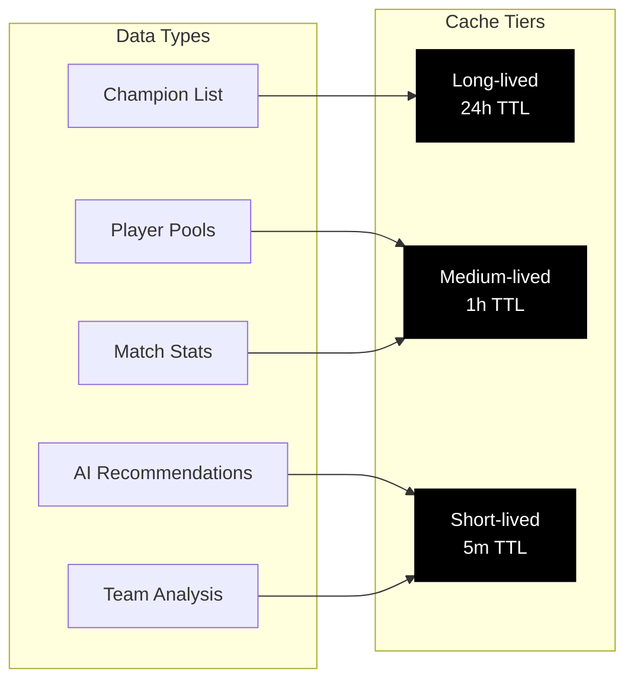

# TeamBuilder - Cloud9 League of Legends Draft Tool

A data-driven drafting assistant for professional esports teams, powered by AI-enhanced real-time analysis and historical match data.

## Project Story

From the era of Sneaky, Meteos and Hai to when Blaber flashed for Scuttle on Nidalee at MSI, C9 has shaped how I go about League. So I came into this hackathon planning to build the best Drafting Tool they could use. Something along the lines of the industry standard like Overwolf or ProComps.

Then I found out we only had access to historic data on GRID, and wanted to run it down like pre-reformed Tyler 1.

But here's the thing - coaches don't need another flashy overlay. They need REAL intel. They need to know that when FNC locks in Azir, they're about to prioritize scaling and give up first dragon 70% of the time. They need to see that Blaber on Lee Sin has a 15% higher first blood rate but dies 2.3 more times per game. They need data that WINS DRAFTS.

So I pivoted. Hard.

TeamBuilder isn't just a draft tracker - it's your scouting department compressed into an app. It's the difference between banning Aatrox because "it's strong" vs banning it because their top laner has an 85% win rate on it in the last month and they always pick it red side when it's available.

This is the tool that gets C9 to Worlds. Again.

## System Architecture



## Data Flow



## Features Overview



## 2026 Draft Rules Support

TeamBuilder fully supports the **2026 League of Legends Pro Play Draft Rules**, including the **First Selection Rule**:

- **First Selection Rule**: Teams can now choose either **Side** (Blue/Red) or **Pick Order** (First/Last)
  - If Team A chooses side, Team B chooses pick order
  - If Team A chooses pick order, Team B chooses side
  - This breaks the old meta where Blue side always had first pick
  - Red side can now have first pick if configured that way

- **Dynamic Draft Sequence**: The draft sequence is automatically generated based on your configuration, ensuring correct pick/ban order regardless of which team has first selection

- **Full Compatibility**: Supports both the new 2026 rules and legacy draft configurations for backwards compatibility

## Tech Stack

### Frontend
- **React 18** with TypeScript
- **Vite** for ultra-fast build and HMR
- **Zustand** for lightweight state management
- **TanStack Query** for server state caching
- **TailwindCSS** for styling
- **Recharts** for data visualization
- **Radix UI** for accessible components

### Backend
- **NestJS** with TypeScript
- **Cerebras AI** for lightning-fast LLM inference
- **Redis** for intelligent caching
- **CSV Parser** for match data processing
- **REST API** for data operations

### Infrastructure
- **Docker** for Redis container
- **Riot Data Dragon CDN** for champion assets

## Getting Started

### Prerequisites
- Node.js 18+
- Docker Desktop
- Cerebras API Key (get from https://cerebras.ai/)

### Installation

```bash
# 1. Clone the repository
git clone https://github.com/yourusername/teambuilder.git
cd teambuilder

# 2. Install dependencies
npm install

# 3. Setup environment variables
cp backend/.env.example backend/.env
# Edit backend/.env and add your CEREBRAS_API_KEY

# 4. Start Redis (required for caching)
docker run -d -p 6379:6379 --name teambuilder-redis redis:alpine

# 5. Start backend server (Terminal 1)
cd backend
npm install
npm run start:dev
# Backend runs on http://localhost:3000

# 6. Start frontend dev server (Terminal 2)
cd frontend
npm install
npm run dev
# Frontend runs on http://localhost:5173
```

Visit **http://localhost:5173** to see the application.

### Quick Start Flow

1. **Select Opponent Team**: Choose from T1, Gen.G, FlyQuest, or other teams
2. **Configure Draft**: Use the 2026 First Selection Rule - choose C9's side (Blue/Red) or pick order (First/Last). The opponent will automatically get the complementary choice.
3. **Start Draft**: Click "Start Draft" to begin the simulation
4. **Draft Phase**: 
   - AI recommends 2-3 champions per unfilled role
   - Click a champion to select it
   - Press Enter or click "Lock in Pick/Ban"
5. **Post-Draft Strategy**: Automatically shown after draft completes
   - View win conditions, team analysis, and game plan
   - Click "Draft Again" to start a new draft

## Project Structure

```
TeamBuilder/
├── frontend/                      # React + Vite application
│   ├── src/
│   │   ├── features/
│   │   │   ├── draft/            # Draft simulator with AI recommendations
│   │   │   │   ├── components/   # Draft UI components
│   │   │   │   ├── store/        # Zustand state management
│   │   │   │   ├── hooks/        # React hooks for AI integration
│   │   │   │   └── types/        # TypeScript types
│   │   │   ├── scouting/         # Player & team analysis
│   │   │   ├── sample-matches/   # Champion statistics from matches
│   │   │   └── team-setup/       # Pre-draft team selection
│   │   ├── store/                # Global app state
│   │   ├── utils/                # Champion image mapper, utilities
│   │   └── components/ui/        # Reusable UI components
│   └── package.json
│
├── backend/                       # NestJS application
│   ├── src/
│   │   ├── draft/                # Draft logic & AI integration
│   │   │   ├── draft.controller.ts      # REST endpoints
│   │   │   ├── draft.service.ts         # Business logic
│   │   │   └── cerebras.service.ts      # AI service
│   │   ├── champions/            # Champion data management
│   │   ├── players/              # Player & team data
│   │   ├── sample-matches/       # Match statistics processing
│   │   └── config/               # Configuration
│   ├── data/                     # CSV data files
│   │   └── sample_matches.csv    # Match data for statistics
│   └── package.json
│
└── README.md
```

## Caching Strategy



**Tier 1: Long-lived Cache (24 hours)**
- Champion data (170+ champions, rarely changes)
- Static assets and configurations

**Tier 2: Medium-lived Cache (1 hour)**
- Player champion pools
- Team rosters and metadata
- Historical match statistics

**Tier 3: Short-lived Cache (5 minutes)**
- AI recommendations (context-dependent)
- Team composition analysis
- Real-time draft state

## API Endpoints

### Draft Endpoints
```
POST   /api/draft/recommendations    # Get AI pick/ban recommendations
POST   /api/draft/strategy           # Get post-draft strategy analysis
```

### Champion Endpoints
```
GET    /api/champions                # Get all champions
GET    /api/champions/:id            # Get champion by ID
```

### Player Endpoints
```
GET    /api/players/c9               # Get C9 roster
GET    /api/players/:id/champion-pool   # Get player's champion pool
```

### Match Statistics
```
GET    /api/sample-matches/top-champions   # Get top champions by win rate
GET    /api/sample-matches/player-stats    # Get player statistics
```

## AI Integration

The application uses **Cerebras AI** for ultra-fast inference (sub-second responses):

**Capabilities:**
- Real-time pick/ban recommendations based on draft state
- Team composition analysis (damage profile, power spikes)
- Win condition generation
- Lane matchup analysis
- Counter-pick suggestions with synergy calculations

**Model:** `llama-3.3-70b` (fastest LLM inference available)

**Prompt Engineering:**
- Dynamic system prompts based on draft phase
- Context includes: team comp, enemy comp, available champions, player pools
- Output parsing with fallback to mock data for reliability

## Development

### Build
```bash
# Frontend production build
cd frontend && npm run build

# Backend production build
cd backend && npm run build
```

### Type Checking
```bash
# Frontend
cd frontend && npx tsc --noEmit

# Backend
cd backend && npx tsc --noEmit
```

### Linting
```bash
# Frontend
cd frontend && npm run lint

# Backend
cd backend && npm run lint
```

## Performance Targets

- ✅ Initial page load: <2 seconds
- ✅ Draft action response: <100ms
- ✅ AI inference latency: <1 second (Cerebras)
- ✅ Cache hit ratio: >80%
- ✅ Champion image load: <200ms (Riot CDN)

## Environment Variables

### Backend (.env)
```env
# Cerebras AI
CEREBRAS_API_KEY=your_api_key_here

# Redis Cache
REDIS_HOST=localhost
REDIS_PORT=6379

# Server
PORT=3000
NODE_ENV=development
```

### Frontend (.env.local)
```env
# Backend API
VITE_API_URL=http://localhost:3000
```

## Deployment

### Docker Deployment
```bash
# Build images
docker build -t teambuilder-frontend ./frontend
docker build -t teambuilder-backend ./backend

# Run with Docker Compose
docker-compose up -d
```

### Production Checklist
- [ ] Set `NODE_ENV=production`
- [ ] Configure Redis persistence
- [ ] Set up SSL/TLS certificates
- [ ] Enable CORS for production domain
- [ ] Configure rate limiting
- [ ] Set up monitoring and logging
- [ ] Configure CDN for static assets

## Troubleshooting

### Common Issues

**Redis Connection Failed**
```bash
# Make sure Redis is running
docker ps | grep redis

# Start Redis if not running
docker run -d -p 6379:6379 --name teambuilder-redis redis:alpine
```

**Champion Images Not Loading**
- The app uses Riot Data Dragon CDN (v16.2.1)
- Check your internet connection
- Verify championImageMapper.ts has correct version

**AI Recommendations Slow**
- Check Cerebras API key is valid
- Verify network connectivity
- Check Redis cache is working (should be instant on cache hit)

**TypeScript Errors**
```bash
# Clear node_modules and reinstall
rm -rf node_modules package-lock.json
npm install
```

## Hackathon Info

- **Event**: Cloud9 x JetBrains "Sky's the Limit"
- **Deadline**: February 3, 2026 at 11:00 AM PST
- **Category**: Comprehensive Assistant Coach (AI-powered analytics)
- **Prize**: $6,000 + GDC trip + JetBrains license + swag

## Contributing

This is a hackathon project. Contributors are welcome to submit PRs for improvements and bug fixes.

## License

MIT

## Acknowledgments

- Cloud9 for inspiring competitive excellence
- Cerebras AI for blazing-fast LLM inference
- Riot Games for Data Dragon CDN
- JetBrains for their excellent development tools
- The open source community for incredible libraries

---

**From Blaber inting for scuttle to Blaber gapping everyone at Worlds. Let's draft the team that gets there.**
